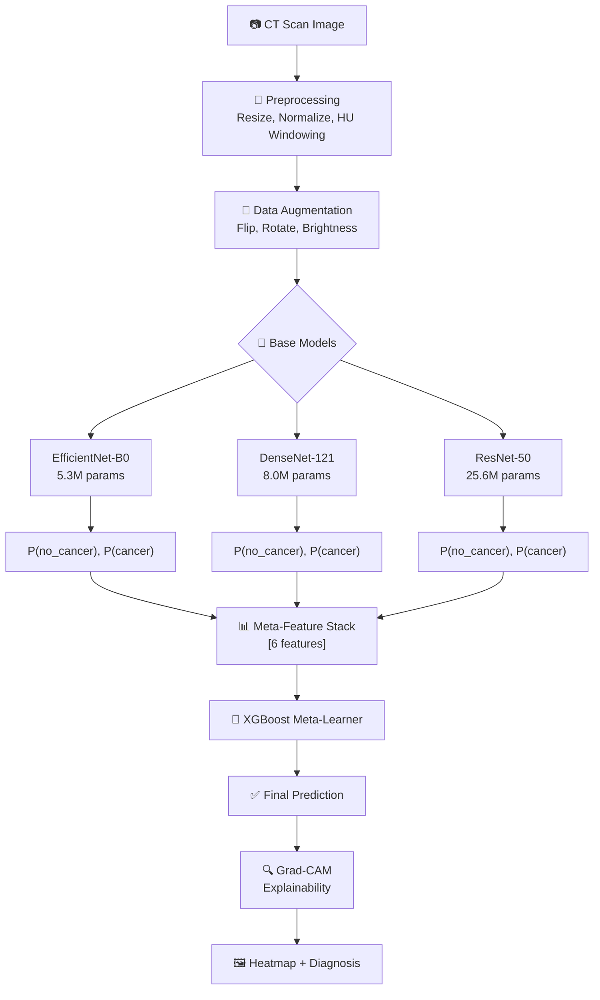
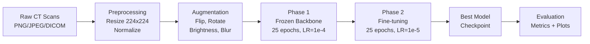
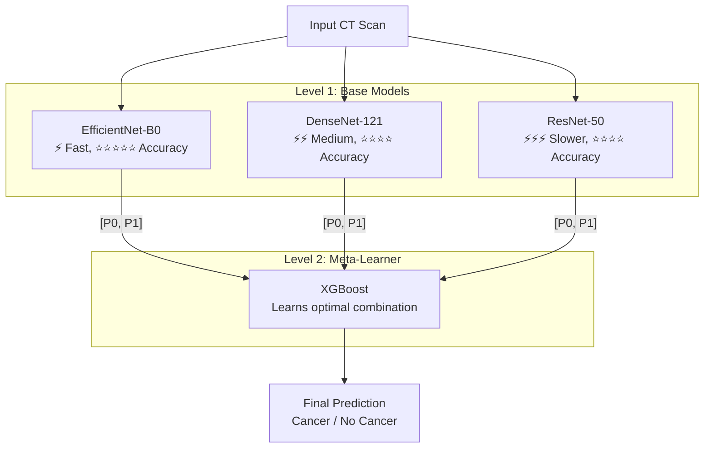
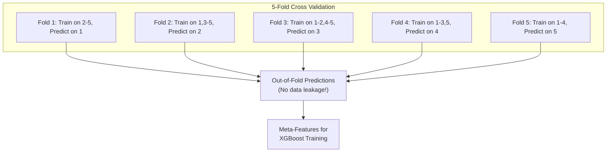
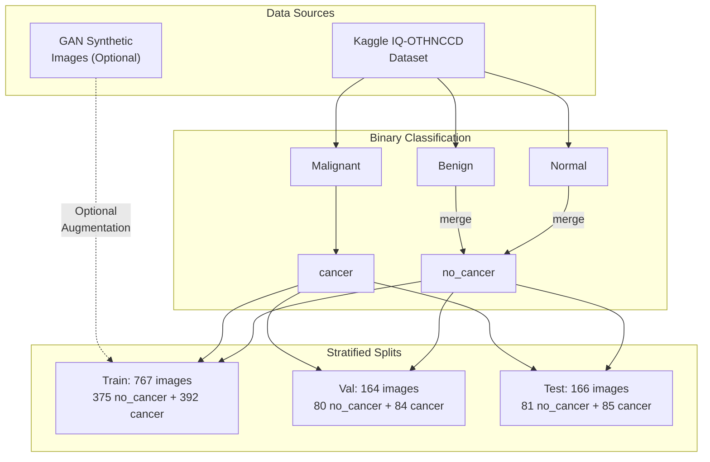
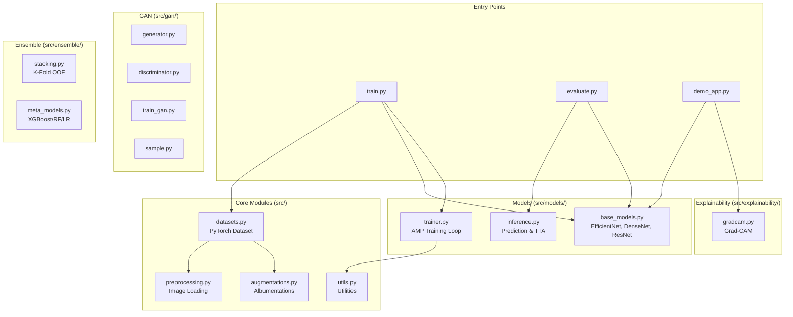
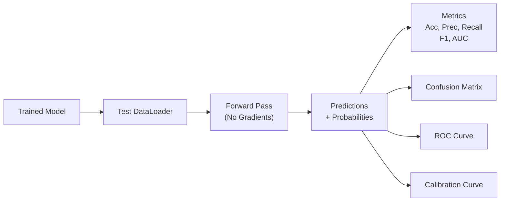

# 🏗️ System Architecture

## Overall System Architecture



---

## Training Pipeline



---

## Stacked Ensemble Architecture



---

## Out-of-Fold Prediction Generation



---

## Grad-CAM Explainability Pipeline

```mermaid
graph LR
    A["Input Image<br/>[1, 3, 224, 224]"] --> B["Forward Pass<br/>Through CNN"]
    B --> C["Prediction<br/>Cancer: 85%"]
    C --> D["Backward Pass<br/>Compute Gradients"]
    D --> E["Global Avg Pool<br/>Gradient Weights"]
    E --> F["Weighted Sum<br/>of Feature Maps"]
    F --> G["ReLU + Normalize<br/>[0, 1]"]
    G --> H["Resize to<br/>Original Size"]
    H --> I["Apply Colormap<br/>JET"]
    I --> J["Overlay on<br/>Original Image"]
```



---

## Data Flow



---

## Project Module Structure



---

## CNN Model Architectures

### EfficientNet-B0

```
Input [3, 224, 224]
    ↓
Pretrained EfficientNet-B0 Backbone (from ImageNet)
    ↓ [1280 features]
Dropout (0.3)
    ↓
Linear (1280 → 512)
    ↓
ReLU
    ↓
Dropout (0.3)
    ↓
Linear (512 → 2)
    ↓
Output [2] → Softmax → [P(no_cancer), P(cancer)]
```

### DenseNet-121

```
Input [3, 224, 224]
    ↓
Pretrained DenseNet-121 Backbone (Dense Blocks × 4)
    ↓ [1024 features]
Dropout (0.3)
    ↓
Linear (1024 → 512)
    ↓
ReLU
    ↓
Dropout (0.3)
    ↓
Linear (512 → 2)
    ↓
Output [2] → Softmax → [P(no_cancer), P(cancer)]
```

### ResNet-50

```
Input [3, 224, 224]
    ↓
Pretrained ResNet-50 Backbone (Residual Blocks × 4)
    ↓ [2048 features]
Dropout (0.3)
    ↓
Linear (2048 → 512)
    ↓
ReLU
    ↓
Dropout (0.3)
    ↓
Linear (512 → 2)
    ↓
Output [2] → Softmax → [P(no_cancer), P(cancer)]
```

---

## GAN Architecture

### Generator

```
Input: Noise z [100] + Label Embedding [10]
    ↓ Concat [110]
Linear (110 → 256 × 4 × 4)
    ↓ Reshape [256, 4, 4]
ConvTranspose2d (256 → 128) + BN + ReLU
    ↓ [128, 8, 8]
ConvTranspose2d (128 → 64) + BN + ReLU
    ↓ [64, 16, 16]
ConvTranspose2d (64 → 32) + BN + ReLU
    ↓ [32, 32, 32]
ConvTranspose2d (32 → 3) + Tanh
    ↓ [3, 64, 64]
Output: Synthetic CT Scan Image
```

### Discriminator

```
Input: Image [3, 64, 64] + Label Embedding [64, 64]
    ↓ Concat [4, 64, 64]
Conv2d (4 → 32) + LeakyReLU + Dropout
    ↓ [32, 32, 32]
Conv2d (32 → 64) + BN + LeakyReLU + Dropout
    ↓ [64, 16, 16]
Conv2d (64 → 128) + BN + LeakyReLU + Dropout
    ↓ [128, 8, 8]
Flatten → Linear → Sigmoid
    ↓
Output: Real/Fake Probability [0, 1]
```

---

## Evaluation Pipeline



---

## Technology Stack

| Layer | Technology | Purpose |
|-------|-----------|---------|
| **Framework** | PyTorch 2.0+ | Deep learning |
| **Models** | EfficientNet, DenseNet, ResNet | Feature extraction |
| **Augmentation** | Albumentations | Image transforms |
| **Meta-Learner** | XGBoost / scikit-learn | Ensemble combination |
| **Explainability** | Grad-CAM | Visual explanations |
| **Demo** | Gradio | Web interface |
| **Medical Imaging** | pydicom, OpenCV | DICOM/image processing |
| **Visualization** | Matplotlib, Seaborn | Plots & charts |

---

**Architecture designed for clinical-grade explainable AI!** 🏗️✨
