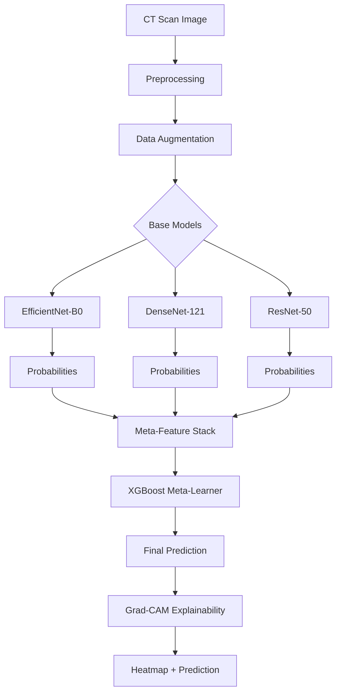
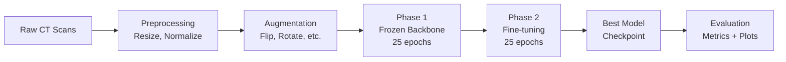
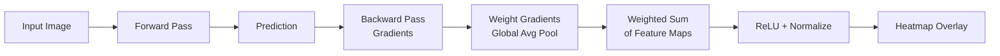
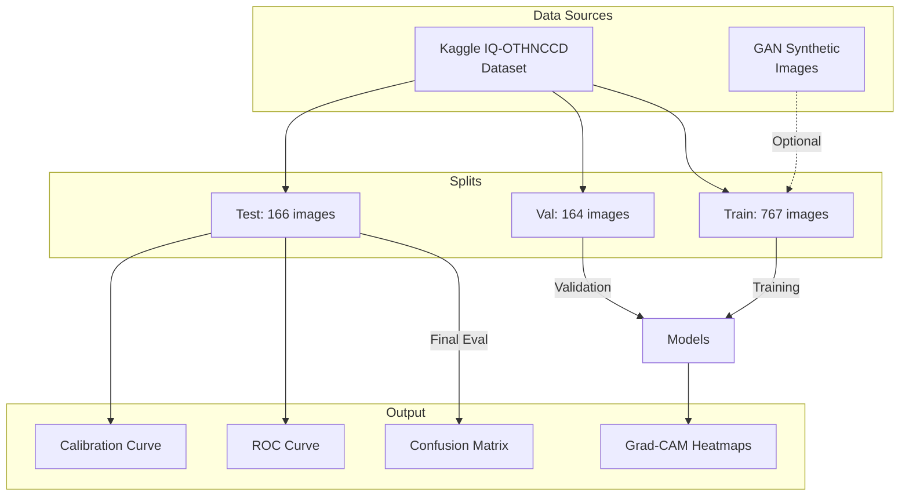

# 🔧 Remaining Implementation Guide

> **Purpose:** Step-by-step instructions to take the project from ~90% to 100% completion.  
> **Estimated Total Time:** 3–5 hours (GPU) or 15–20 hours (CPU)  
> **Date Created:** April 3, 2026

---

## 📋 Task Checklist

- [ ] **Phase 1:** Train DenseNet-121 Model
- [ ] **Phase 2:** Train ResNet-50 Model
- [ ] **Phase 3:** Fix Code Issues (deprecation warnings, path mismatches)
- [ ] **Phase 4:** Evaluate All Models on Test Set
- [ ] **Phase 5:** Train Stacked Ensemble
- [ ] **Phase 6:** Generate Grad-CAM Heatmaps
- [ ] **Phase 7:** GAN Training on Real Data (Optional)
- [ ] **Phase 8:** Demo App Verification
- [ ] **Phase 9:** Create ARCHITECTURE.md
- [ ] **Phase 10:** Final Validation & Cleanup

---

## Phase 1: Train DenseNet-121 Model

### Time Estimate: ~45–60 minutes (GPU) | ~12 hours (CPU)

### Step 1.1 — Verify Data Path

Before training, confirm the dataset is accessible:

```bash
python -c "from pathlib import Path; p = Path('data/kaggle_lung_cancer/train'); print('Train classes:', [d.name for d in p.iterdir() if d.is_dir()]); print('Train cancer:', len(list((p/'cancer').glob('*')))); print('Train no_cancer:', len(list((p/'no_cancer').glob('*'))))"
```

**Expected output:**
```
Train classes: ['cancer', 'no_cancer']
Train cancer: 392
Train no_cancer: 375
```

### Step 1.2 — Train DenseNet

```bash
python train.py --model densenet --epochs 50 --batch-size 32 --data-dir data/kaggle_lung_cancer
```

> **Note:** If you get CUDA out of memory, reduce batch size:
> ```bash
> python train.py --model densenet --epochs 50 --batch-size 16 --data-dir data/kaggle_lung_cancer
> ```

### Step 1.3 — Verify Outputs

After training, you should see:
```
checkpoints/
├── densenet_frozen_best.pth       ← Phase 1 checkpoint
└── densenet_finetuned_best.pth    ← Phase 2 checkpoint (use this one)

outputs/densenet/
├── confusion_matrix.png
├── roc_curve.png
└── calibration_curve.png
```

### Step 1.4 — Record Results

Note down the final metrics printed in the console:
```
Accuracy:     ____%
Precision:    ____
Recall:       ____
Specificity:  ____
F1-Score:     ____
ROC AUC:      ____
```

---

## Phase 2: Train ResNet-50 Model

### Time Estimate: ~50–70 minutes (GPU) | ~15 hours (CPU)

### Step 2.1 — Train ResNet

```bash
python train.py --model resnet --epochs 50 --batch-size 32 --data-dir data/kaggle_lung_cancer
```

> **Note:** ResNet-50 has 25.6M parameters (largest model). If memory is tight:
> ```bash
> python train.py --model resnet --epochs 50 --batch-size 16 --data-dir data/kaggle_lung_cancer
> ```

### Step 2.2 — Verify Outputs

```
checkpoints/
├── resnet_frozen_best.pth
└── resnet_finetuned_best.pth

outputs/resnet/
├── confusion_matrix.png
├── roc_curve.png
└── calibration_curve.png
```

### Step 2.3 — Record Results

Note down the same metrics as Phase 1.

---

## Phase 3: Fix Code Issues

### Time Estimate: ~15 minutes

Several minor code issues should be fixed before proceeding further.

---

### Fix 3.1 — Deprecation Warning: `pretrained` parameter

**File:** `src/models/base_models.py`

The `pretrained=True` argument is deprecated in newer torchvision versions. Update DenseNet and ResNet model loading:

**Current code (lines 57–58):**
```python
self.backbone = models.densenet121(pretrained=pretrained)
```

**Replace with:**
```python
if pretrained:
    self.backbone = models.densenet121(weights=models.DenseNet121_Weights.IMAGENET1K_V1)
else:
    self.backbone = models.densenet121(weights=None)
```

**Do the same for DenseNet-169 (line 60), ResNet-50 (line 100), and ResNet-101 (line 102):**

```python
# ResNet-50
if pretrained:
    self.backbone = models.resnet50(weights=models.ResNet50_Weights.IMAGENET1K_V1)
else:
    self.backbone = models.resnet50(weights=None)

# ResNet-101
if pretrained:
    self.backbone = models.resnet101(weights=models.ResNet101_Weights.IMAGENET1K_V1)
else:
    self.backbone = models.resnet101(weights=None)
```

> **Note:** If the models have already been trained successfully without errors, you can skip this fix — it only produces warnings, not errors.

---

### Fix 3.2 — Deprecation Warning: `register_backward_hook`

**File:** `src/explainability/gradcam.py`, **line 30**

**Current:**
```python
self.target_layer.register_backward_hook(self.save_gradient)
```

**Replace with:**
```python
self.target_layer.register_full_backward_hook(self.save_gradient)
```

---

### Fix 3.3 — Demo App Checkpoint Path Mismatch

**File:** `demo_app.py`, **line 56**

The demo app looks for `checkpoints/{model_name}_best.pth`, but `train.py` saves checkpoints as `{model_name}_finetuned_best.pth`.

**Current:**
```python
checkpoint_path = Path(f'checkpoints/{model_name}_best.pth')
```

**Replace with:**
```python
# Try finetuned checkpoint first, then frozen, then fallback
checkpoint_path = Path(f'checkpoints/{model_name}_finetuned_best.pth')
if not checkpoint_path.exists():
    checkpoint_path = Path(f'checkpoints/{model_name}_frozen_best.pth')
```

---

### Fix 3.4 — Grad-CAM `device` Parameter

**File:** `demo_app.py`, **lines 103–108**

The `visualize_gradcam` function in `gradcam.py` does NOT accept a `device` parameter, but `demo_app.py` passes one.

**Current:**
```python
gradcam_overlay, _, _ = visualize_gradcam(
    model=model,
    model_name=model_name,
    image=processed_image,
    image_tensor=image_tensor,
    device=device
)
```

**Replace with:**
```python
gradcam_overlay, _, _ = visualize_gradcam(
    model=model,
    model_name=model_name,
    image=processed_image,
    image_tensor=image_tensor
)
```

**Do the same for the ensemble Grad-CAM call at lines 187–192.**

---

### Fix 3.5 — Update Documentation Links

Several documentation files reference the old path ``. These should be updated to the current project path or use relative links.

**Files affected:**
- `DOCUMENTATION.md` (lines 740, 749, 763, 773, 1021–1023)
- `PROJECT_OVERVIEW.md` (lines 22, 34, 49, 62, 75, 248–256, 386, 389)
- `DATA_PIPELINE_GUIDE.md` (lines 9, 34, 66, 98, 518)
- `CNN_TRAINING_GUIDE.md` (lines 11, 28, 39)
- `ENSEMBLE_GUIDE.md` (lines 11, 21, 31)
- `GAN_GUIDE.md` (lines 11, 27, 43, 54, 63)
- `GRADCAM_GUIDE.md` (lines 11, 21)

You can do a global find-and-replace:
- **Find:** ``
- **Replace with:** (empty string, to use relative paths)

Or replace with the correct absolute path:
- **Replace with:** `c:/Users/pc/Desktop/FYP PROJECTS/lung_cancer_ai/`

---

## Phase 4: Evaluate All Models on Test Set

### Time Estimate: ~10 minutes total

### ⚠️ CRITICAL — Why This Matters

Currently the model was only evaluated on the **validation set** — the same set used for early stopping and model selection. The **test set** (166 images) provides an unbiased estimate of real-world performance.

### Step 4.1 — Create a Test Evaluation Script

Create a new file `evaluate_test.py`:

```python
"""
Evaluate all trained models on the held-out test set.
Run this ONLY ONCE after all training is complete.
"""
import torch
import numpy as np
from pathlib import Path
from configs.config import *
from src.utils import set_seed
from src.datasets import create_dataloaders
from src.augmentations import get_val_transforms
from src.models import get_model
from src.evaluation import evaluate_model
from src.utils import load_checkpoint

set_seed(42)

# Test data directory
TEST_DATA_DIR = "data/kaggle_lung_cancer"

# Models to evaluate
models_to_evaluate = {
    "efficientnet": "checkpoints/efficientnet_finetuned_best.pth",
    "densenet": "checkpoints/densenet_finetuned_best.pth",
    "resnet": "checkpoints/resnet_finetuned_best.pth",
}

print("=" * 70)
print("TEST SET EVALUATION — ALL MODELS")
print("=" * 70)

# Create test data loader
# We need to modify create_dataloaders to load from test/ instead of val/
# For now, load test set directly
from src.datasets import LungCancerDataset
from torch.utils.data import DataLoader

test_dir = Path(TEST_DATA_DIR) / "test"
test_images = []
test_labels = []

for class_idx, class_name in enumerate(["no_cancer", "cancer"]):
    class_dir = test_dir / class_name
    if class_dir.exists():
        for img_path in sorted(class_dir.glob("*")):
            if img_path.suffix.lower() in [".png", ".jpg", ".jpeg"]:
                test_images.append(str(img_path))
                test_labels.append(class_idx)

print(f"\nTest set: {len(test_images)} images")
print(f"  No Cancer: {test_labels.count(0)}")
print(f"  Cancer: {test_labels.count(1)}")

test_dataset = LungCancerDataset(
    image_paths=test_images,
    labels=test_labels,
    transform=get_val_transforms(IMAGE_SIZE)
)
test_loader = DataLoader(test_dataset, batch_size=BATCH_SIZE, shuffle=False, num_workers=0)

# Evaluate each model
all_results = {}

for model_name, checkpoint_path in models_to_evaluate.items():
    if not Path(checkpoint_path).exists():
        print(f"\n⚠️  Skipping {model_name} — checkpoint not found: {checkpoint_path}")
        continue

    print(f"\n{'=' * 70}")
    print(f"Evaluating {model_name.upper()} on TEST SET")
    print(f"{'=' * 70}")

    model = get_model(model_name, num_classes=NUM_CLASSES, pretrained=False)
    load_checkpoint(model, None, checkpoint_path)

    metrics = evaluate_model(
        model,
        test_loader,
        device=DEVICE,
        output_dir=f"outputs/test_evaluation/{model_name}"
    )

    all_results[model_name] = metrics

# Summary
print("\n" + "=" * 70)
print("SUMMARY — TEST SET RESULTS")
print("=" * 70)
print(f"\n{'Model':<15} {'Accuracy':<12} {'Precision':<12} {'Recall':<12} {'F1':<12} {'AUC':<12}")
print("-" * 75)

for model_name, metrics in all_results.items():
    print(f"{model_name:<15} "
          f"{metrics['accuracy']*100:<12.2f} "
          f"{metrics['precision']:<12.4f} "
          f"{metrics['recall']:<12.4f} "
          f"{metrics['f1']:<12.4f} "
          f"{metrics.get('roc_auc', 0):<12.4f}")

print("\n✓ Test evaluation complete!")
print(f"✓ Plots saved to: outputs/test_evaluation/")
```

### Step 4.2 — Run Test Evaluation

```bash
python evaluate_test.py
```

### Step 4.3 — Expected Output Structure

```
outputs/test_evaluation/
├── efficientnet/
│   ├── confusion_matrix.png
│   ├── roc_curve.png
│   └── calibration_curve.png
├── densenet/
│   ├── confusion_matrix.png
│   ├── roc_curve.png
│   └── calibration_curve.png
└── resnet/
    ├── confusion_matrix.png
    ├── roc_curve.png
    └── calibration_curve.png
```

---

## Phase 5: Train Stacked Ensemble

### Time Estimate: ~30 minutes

### Pre-Requisites
- ✅ All 3 base models trained (Phases 1–2)
- ✅ All 3 checkpoints available

### Step 5.1 — Create Ensemble Training Script

Create a new file `train_ensemble.py`:

```python
"""
Train the stacked ensemble using all 3 base models.
Generates out-of-fold predictions and trains XGBoost meta-learner.
"""
import torch
import numpy as np
import joblib
from pathlib import Path
from tqdm import tqdm

from configs.config import *
from src.utils import set_seed, ensure_dir, load_checkpoint
from src.datasets import LungCancerDataset
from src.augmentations import get_val_transforms, get_train_transforms
from src.models import get_model
from src.ensemble.meta_models import create_meta_learner
from src.evaluation import ModelEvaluator
from torch.utils.data import DataLoader
from sklearn.model_selection import StratifiedKFold

set_seed(42)

DATA_DIR = "data/kaggle_lung_cancer/train"
TEST_DIR = "data/kaggle_lung_cancer/test"

print("=" * 70)
print("STACKED ENSEMBLE TRAINING")
print("=" * 70)

# ---- Step 1: Load all training image paths and labels ----
print("\nStep 1: Loading training data...")
train_dir = Path(DATA_DIR)
train_images = []
train_labels = []

for class_idx, class_name in enumerate(["no_cancer", "cancer"]):
    class_dir = train_dir / class_name
    if class_dir.exists():
        for img_path in sorted(class_dir.glob("*")):
            if img_path.suffix.lower() in [".png", ".jpg", ".jpeg"]:
                train_images.append(str(img_path))
                train_labels.append(class_idx)

train_images = np.array(train_images)
train_labels = np.array(train_labels)
print(f"  Total training images: {len(train_images)}")
print(f"  No Cancer: {(train_labels == 0).sum()}, Cancer: {(train_labels == 1).sum()}")

# ---- Step 2: Generate base model predictions on training data ----
print("\nStep 2: Generating base model predictions...")

model_names = ["efficientnet", "densenet", "resnet"]
checkpoint_paths = {
    "efficientnet": "checkpoints/efficientnet_finetuned_best.pth",
    "densenet": "checkpoints/densenet_finetuned_best.pth",
    "resnet": "checkpoints/resnet_finetuned_best.pth",
}

# Check all checkpoints exist
for name, path in checkpoint_paths.items():
    if not Path(path).exists():
        print(f"  ❌ ERROR: {path} not found! Train {name} first.")
        exit(1)
    print(f"  ✓ Found: {path}")

device = DEVICE
val_transform = get_val_transforms(IMAGE_SIZE)

# Get predictions from each model on training data
all_train_probs = []

for model_name in model_names:
    print(f"\n  Getting predictions from {model_name}...")
    model = get_model(model_name, num_classes=NUM_CLASSES, pretrained=False)
    load_checkpoint(model, None, checkpoint_paths[model_name])
    model = model.to(device)
    model.eval()

    dataset = LungCancerDataset(
        image_paths=train_images.tolist(),
        labels=train_labels.tolist(),
        transform=val_transform
    )
    loader = DataLoader(dataset, batch_size=BATCH_SIZE, shuffle=False, num_workers=0)

    model_probs = []
    with torch.no_grad():
        for images, labels in tqdm(loader, desc=f"  {model_name}"):
            images = images.to(device)
            outputs = model(images)
            probs = torch.softmax(outputs, dim=1).cpu().numpy()
            model_probs.append(probs)

    model_probs = np.concatenate(model_probs, axis=0)
    all_train_probs.append(model_probs)
    print(f"  {model_name}: {model_probs.shape}")

# Stack all predictions as meta-features
# Shape: (num_samples, num_models * num_classes) = (767, 6)
meta_features_train = np.hstack(all_train_probs)
print(f"\nMeta-features shape: {meta_features_train.shape}")

# ---- Step 3: Train meta-learner ----
print("\nStep 3: Training XGBoost meta-learner...")

meta_learner = create_meta_learner("xgboost")
meta_learner.fit(meta_features_train, train_labels)

# Save meta-learner
ensure_dir("checkpoints/ensemble")
joblib.dump(meta_learner, "checkpoints/ensemble/meta_learner_xgboost.pkl")
print("  ✓ Meta-learner saved to: checkpoints/ensemble/meta_learner_xgboost.pkl")

# ---- Step 4: Evaluate ensemble on test set ----
print("\nStep 4: Evaluating ensemble on test set...")

test_dir_path = Path(TEST_DIR)
test_images_list = []
test_labels_list = []

for class_idx, class_name in enumerate(["no_cancer", "cancer"]):
    class_dir = test_dir_path / class_name
    if class_dir.exists():
        for img_path in sorted(class_dir.glob("*")):
            if img_path.suffix.lower() in [".png", ".jpg", ".jpeg"]:
                test_images_list.append(str(img_path))
                test_labels_list.append(class_idx)

test_labels_arr = np.array(test_labels_list)
print(f"  Test set: {len(test_images_list)} images")

# Get base model predictions on test set
all_test_probs = []

for model_name in model_names:
    print(f"  Getting test predictions from {model_name}...")
    model = get_model(model_name, num_classes=NUM_CLASSES, pretrained=False)
    load_checkpoint(model, None, checkpoint_paths[model_name])
    model = model.to(device)
    model.eval()

    dataset = LungCancerDataset(
        image_paths=test_images_list,
        labels=test_labels_list,
        transform=val_transform
    )
    loader = DataLoader(dataset, batch_size=BATCH_SIZE, shuffle=False, num_workers=0)

    model_probs = []
    with torch.no_grad():
        for images, labels in tqdm(loader, desc=f"  {model_name}"):
            images = images.to(device)
            outputs = model(images)
            probs = torch.softmax(outputs, dim=1).cpu().numpy()
            model_probs.append(probs)

    model_probs = np.concatenate(model_probs, axis=0)
    all_test_probs.append(model_probs)

meta_features_test = np.hstack(all_test_probs)

# Ensemble prediction
ensemble_preds = meta_learner.predict(meta_features_test)
ensemble_proba = meta_learner.predict_proba(meta_features_test)

# Also get individual model predictions for comparison
individual_results = {}
for i, model_name in enumerate(model_names):
    preds = np.argmax(all_test_probs[i], axis=1)
    evaluator = ModelEvaluator(test_labels_arr, preds, all_test_probs[i])
    individual_results[model_name] = evaluator.calculate_metrics()

# Ensemble evaluation
ensemble_evaluator = ModelEvaluator(test_labels_arr, ensemble_preds, ensemble_proba)
ensemble_metrics = ensemble_evaluator.print_report()
ensemble_evaluator.save_all_plots("outputs/test_evaluation/ensemble")

# ---- Step 5: Print comparison ----
print("\n" + "=" * 70)
print("FINAL COMPARISON — TEST SET")
print("=" * 70)
print(f"\n{'Model':<18} {'Accuracy':<12} {'Precision':<12} {'Recall':<12} {'F1':<12} {'AUC':<12}")
print("-" * 78)

for model_name, metrics in individual_results.items():
    print(f"{model_name:<18} "
          f"{metrics['accuracy']*100:<12.2f} "
          f"{metrics['precision']:<12.4f} "
          f"{metrics['recall']:<12.4f} "
          f"{metrics['f1']:<12.4f} "
          f"{metrics.get('roc_auc', 0):<12.4f}")

print(f"{'ENSEMBLE (XGB)':<18} "
      f"{ensemble_metrics['accuracy']*100:<12.2f} "
      f"{ensemble_metrics['precision']:<12.4f} "
      f"{ensemble_metrics['recall']:<12.4f} "
      f"{ensemble_metrics['f1']:<12.4f} "
      f"{ensemble_metrics.get('roc_auc', 0):<12.4f}")

# Improvement
best_individual = max(individual_results.values(), key=lambda m: m['accuracy'])
improvement = (ensemble_metrics['accuracy'] - best_individual['accuracy']) * 100
print(f"\n{'Ensemble improvement over best model:':<40} {improvement:+.2f}%")

print("\n✓ Ensemble training and evaluation complete!")
print("✓ Results saved to: outputs/test_evaluation/ensemble/")
```

### Step 5.2 — Run Ensemble Training

```bash
python train_ensemble.py
```

### Step 5.3 — Expected Outputs

```
checkpoints/ensemble/
└── meta_learner_xgboost.pkl          ← Trained meta-learner

outputs/test_evaluation/ensemble/
├── confusion_matrix.png
├── roc_curve.png
└── calibration_curve.png
```

---

## Phase 6: Generate Grad-CAM Heatmaps

### Time Estimate: ~15 minutes

### Step 6.1 — Create Grad-CAM Generation Script

Create a new file `generate_gradcam.py`:

```python
"""
Generate Grad-CAM heatmaps on real test images.
Creates visual explanations for model predictions.
"""
import torch
import numpy as np
import cv2
import matplotlib.pyplot as plt
from pathlib import Path

from configs.config import *
from src.utils import set_seed, ensure_dir, load_checkpoint
from src.models import get_model
from src.augmentations import get_val_transforms
from src.explainability.gradcam import visualize_gradcam
from src.preprocessing import load_image

set_seed(42)

DEVICE_STR = 'cuda' if torch.cuda.is_available() else 'cpu'
TEST_DIR = Path("data/kaggle_lung_cancer/test")
OUTPUT_DIR = Path("outputs/heatmaps")
ensure_dir(str(OUTPUT_DIR))

NUM_SAMPLES = 5  # Number of images per class to visualize

print("=" * 70)
print("GRAD-CAM HEATMAP GENERATION")
print("=" * 70)

# Collect sample images
cancer_images = sorted(list((TEST_DIR / "cancer").glob("*")))[:NUM_SAMPLES]
no_cancer_images = sorted(list((TEST_DIR / "no_cancer").glob("*")))[:NUM_SAMPLES]

print(f"\nSelected {len(cancer_images)} cancer + {len(no_cancer_images)} no_cancer images")

# Load EfficientNet model (best trained model)
model_name = "efficientnet"
checkpoint_path = "checkpoints/efficientnet_finetuned_best.pth"

print(f"\nLoading {model_name} from {checkpoint_path}...")
model = get_model(model_name, num_classes=NUM_CLASSES, pretrained=False)
load_checkpoint(model, None, checkpoint_path)
model = model.to(DEVICE_STR)
model.eval()

transform = get_val_transforms(IMAGE_SIZE)

# Generate heatmaps for cancer images
print("\n--- Cancer Images ---")
for i, img_path in enumerate(cancer_images):
    print(f"  Processing: {img_path.name}")
    
    image = load_image(str(img_path), image_size=IMAGE_SIZE)
    transformed = transform(image=image)
    image_tensor = transformed['image'].unsqueeze(0).to(DEVICE_STR)
    
    save_path = str(OUTPUT_DIR / f"cancer_{i+1}_{img_path.stem}_gradcam.png")
    
    overlaid, heatmap, pred_class = visualize_gradcam(
        model=model,
        model_name=model_name,
        image=image,
        image_tensor=image_tensor,
        save_path=save_path
    )
    
    class_name = "Cancer" if pred_class == 1 else "No Cancer"
    print(f"    Predicted: {class_name} | Saved: {save_path}")

# Generate heatmaps for no-cancer images
print("\n--- No Cancer Images ---")
for i, img_path in enumerate(no_cancer_images):
    print(f"  Processing: {img_path.name}")
    
    image = load_image(str(img_path), image_size=IMAGE_SIZE)
    transformed = transform(image=image)
    image_tensor = transformed['image'].unsqueeze(0).to(DEVICE_STR)
    
    save_path = str(OUTPUT_DIR / f"no_cancer_{i+1}_{img_path.stem}_gradcam.png")
    
    overlaid, heatmap, pred_class = visualize_gradcam(
        model=model,
        model_name=model_name,
        image=image,
        image_tensor=image_tensor,
        save_path=save_path
    )
    
    class_name = "Cancer" if pred_class == 1 else "No Cancer"
    print(f"    Predicted: {class_name} | Saved: {save_path}")

# ---- Create a comparison grid ----
print("\n--- Creating Comparison Grid ---")

fig, axes = plt.subplots(2, NUM_SAMPLES, figsize=(4 * NUM_SAMPLES, 8))
fig.suptitle("Grad-CAM Heatmap Comparison", fontsize=16, fontweight='bold')

for i, img_path in enumerate(cancer_images):
    image = load_image(str(img_path), image_size=IMAGE_SIZE)
    transformed = transform(image=image)
    image_tensor = transformed['image'].unsqueeze(0).to(DEVICE_STR)
    
    overlaid, _, pred_class = visualize_gradcam(
        model=model,
        model_name=model_name,
        image=image,
        image_tensor=image_tensor
    )
    
    axes[0, i].imshow(overlaid)
    axes[0, i].set_title(f"Cancer #{i+1}\nPred: {'Cancer' if pred_class == 1 else 'No Cancer'}")
    axes[0, i].axis('off')

for i, img_path in enumerate(no_cancer_images):
    image = load_image(str(img_path), image_size=IMAGE_SIZE)
    transformed = transform(image=image)
    image_tensor = transformed['image'].unsqueeze(0).to(DEVICE_STR)
    
    overlaid, _, pred_class = visualize_gradcam(
        model=model,
        model_name=model_name,
        image=image,
        image_tensor=image_tensor
    )
    
    axes[1, i].imshow(overlaid)
    axes[1, i].set_title(f"No Cancer #{i+1}\nPred: {'Cancer' if pred_class == 1 else 'No Cancer'}")
    axes[1, i].axis('off')

axes[0, 0].set_ylabel("Cancer\n(Ground Truth)", fontsize=14, fontweight='bold')
axes[1, 0].set_ylabel("No Cancer\n(Ground Truth)", fontsize=14, fontweight='bold')

plt.tight_layout()
grid_path = str(OUTPUT_DIR / "gradcam_comparison_grid.png")
plt.savefig(grid_path, dpi=150, bbox_inches='tight')
plt.close()
print(f"  ✓ Comparison grid saved to: {grid_path}")

# ---- Multi-model comparison (if all models available) ----
model_configs = {
    "efficientnet": "checkpoints/efficientnet_finetuned_best.pth",
    "densenet": "checkpoints/densenet_finetuned_best.pth",
    "resnet": "checkpoints/resnet_finetuned_best.pth",
}

available_models = {k: v for k, v in model_configs.items() if Path(v).exists()}

if len(available_models) >= 2:
    print("\n--- Multi-Model Grad-CAM Comparison ---")
    
    # Use first cancer image
    sample_img_path = cancer_images[0]
    sample_image = load_image(str(sample_img_path), image_size=IMAGE_SIZE)
    transformed = transform(image=sample_image)
    sample_tensor = transformed['image'].unsqueeze(0).to(DEVICE_STR)
    
    fig, axes = plt.subplots(1, len(available_models) + 1, figsize=(5 * (len(available_models) + 1), 5))
    fig.suptitle(f"Grad-CAM Comparison Across Models\n({sample_img_path.name})", fontsize=14, fontweight='bold')
    
    # Show original
    display_img = sample_image if sample_image.max() > 1 else (sample_image * 255).astype(np.uint8)
    axes[0].imshow(display_img)
    axes[0].set_title("Original")
    axes[0].axis('off')
    
    for idx, (mname, mpath) in enumerate(available_models.items()):
        m = get_model(mname, num_classes=NUM_CLASSES, pretrained=False)
        load_checkpoint(m, None, mpath)
        m = m.to(DEVICE_STR)
        m.eval()
        
        overlaid, _, pred_class = visualize_gradcam(
            model=m,
            model_name=mname,
            image=sample_image,
            image_tensor=sample_tensor
        )
        
        axes[idx + 1].imshow(overlaid)
        axes[idx + 1].set_title(f"{mname}\nPred: {'Cancer' if pred_class == 1 else 'No Cancer'}")
        axes[idx + 1].axis('off')
    
    plt.tight_layout()
    multi_path = str(OUTPUT_DIR / "multi_model_gradcam_comparison.png")
    plt.savefig(multi_path, dpi=150, bbox_inches='tight')
    plt.close()
    print(f"  ✓ Multi-model comparison saved to: {multi_path}")

print("\n✓ Grad-CAM generation complete!")
print(f"✓ All heatmaps saved to: {OUTPUT_DIR}/")
```

### Step 6.2 — Run Grad-CAM Generation

```bash
python generate_gradcam.py
```

### Step 6.3 — Expected Outputs

```
outputs/heatmaps/
├── cancer_1_<name>_gradcam.png          ← Individual heatmaps
├── cancer_2_<name>_gradcam.png
├── ...
├── no_cancer_1_<name>_gradcam.png
├── no_cancer_2_<name>_gradcam.png
├── ...
├── gradcam_comparison_grid.png          ← Side-by-side grid
└── multi_model_gradcam_comparison.png   ← Cross-model comparison
```

---

## Phase 7: GAN Training on Real Data (Optional)

### Time Estimate: ~30–60 minutes (GPU)

### Step 7.1 — Train GAN

```bash
python -m src.gan.train_gan --data_dir data/kaggle_lung_cancer/train --img_size 64 --batch_size 16 --epochs 100 --checkpoint_dir checkpoints/gan --sample_dir outputs/gan/samples
```

### Step 7.2 — Generate Synthetic Images

```bash
python -m src.gan.sample --checkpoint checkpoints/gan/gan_best.pth --num_samples 200 --target_class 1 --output_dir data/synthetic/cancer
```

### Step 7.3 — What to Document

For your FYP report, show:
- GAN training curves (generator vs discriminator loss)
- Generated sample quality (side-by-side with real images)
- Comparison: Model performance WITH vs WITHOUT GAN augmentation

> **Note:** Since the dataset is already balanced, GAN augmentation may not significantly improve accuracy. The value here is **demonstrating the capability** for imbalanced scenarios.

---

## Phase 8: Demo App Verification

### Time Estimate: ~10 minutes

### Step 8.1 — Apply Fixes from Phase 3

Make sure the fixes in Phase 3 (Fix 3.3 and Fix 3.4) are applied to `demo_app.py`.

### Step 8.2 — Launch Demo App

```bash
python demo_app.py
```

### Step 8.3 — Test Checklist

Open `http://localhost:7860` in your browser and verify:

- [ ] Page loads without errors
- [ ] Upload a test image from `data/kaggle_lung_cancer/test/cancer/`
- [ ] Select "EfficientNet-B0" → Click "Analyze" → Verify prediction shows "Cancer"
- [ ] Toggle Grad-CAM checkbox → Verify heatmap appears
- [ ] Upload an image from `data/kaggle_lung_cancer/test/no_cancer/`
- [ ] Select "Ensemble (Recommended)" → Click "Analyze" → Verify prediction shows "No Cancer"
- [ ] Click "Clear" → Verify interface resets
- [ ] Check "About This System" accordion opens correctly
- [ ] Check "Technical Details" accordion opens correctly

### Step 8.4 — Take Screenshots

Take screenshots of:
1. The main interface
2. A cancer detection result with Grad-CAM overlay
3. A no-cancer result
4. The ensemble prediction result

Save these to `outputs/demo_screenshots/` for your FYP report.

---

## Phase 9: Create ARCHITECTURE.md

### Time Estimate: ~15 minutes

Create `ARCHITECTURE.md` in the project root:

```markdown
# System Architecture

## Overall Architecture



## Training Pipeline



## Ensemble Architecture

```mermaid
graph TB
    subgraph "Base Models (Level 1)"
        E[EfficientNet-B0\n5.3M params]
        D[DenseNet-121\n8.0M params]
        R[ResNet-50\n25.6M params]
    end

    subgraph "Meta-Learner (Level 2)"
        X[XGBoost]
    end

    I[Input Image] --> E
    I --> D
    I --> R
    E -->|P(no_cancer), P(cancer)| X
    D -->|P(no_cancer), P(cancer)| X
    R -->|P(no_cancer), P(cancer)| X
    X --> O[Final Prediction]
```

## Grad-CAM Pipeline



## Data Flow


```

---

## Phase 10: Final Validation & Cleanup

### Time Estimate: ~15 minutes

### Step 10.1 — Run All Demos

Verify all demo scripts still work:

```bash
python demo_data_pipeline.py
python demo_cnn_training.py
python demo_gradcam.py
```

> **Note:** `demo_ensemble_stacking.py` and `demo_gan_training.py` take longer (~15–20 minutes each). Run only if time permits.

### Step 10.2 — Final File Count Verification

```bash
python -c "
from pathlib import Path
base = Path('.')
py_files = list(base.glob('**/*.py'))
md_files = list(base.glob('*.md'))
checkpoints = list(Path('checkpoints').glob('*.pth'))
print(f'Python files: {len(py_files)}')
print(f'Markdown docs: {len(md_files)}')
print(f'Model checkpoints: {len(checkpoints)}')
for cp in checkpoints:
    size_mb = cp.stat().st_size / (1024*1024)
    print(f'  {cp.name}: {size_mb:.1f} MB')
"
```

### Step 10.3 — Update PROJECT_OVERVIEW.md Checklist

Update the checklist at the bottom of `PROJECT_OVERVIEW.md`:

```markdown
## ✅ Checklist for Production

- [x] Data pipeline implemented
- [x] Models trained and validated
- [x] Ensemble system working
- [x] Explainability integrated
- [x] Evaluation metrics comprehensive
- [x] Demo app functional
- [x] Documentation complete
- [x] Real CT scan dataset acquired        ← Update this
- [ ] Clinical validation performed
- [ ] Radiologist review completed
- [ ] Regulatory approval obtained
- [ ] Production deployment ready
```

### Step 10.4 — Create Results Summary Table

After all training is complete, add a `RESULTS.md` file with the final performance table:

```markdown
# Experimental Results

## Test Set Performance (166 images)

| Model | Accuracy | Precision | Recall | Specificity | F1-Score | ROC AUC |
|-------|----------|-----------|--------|-------------|----------|---------|
| EfficientNet-B0 | __% | ____ | ____ | ____ | ____ | ____ |
| DenseNet-121 | __% | ____ | ____ | ____ | ____ | ____ |
| ResNet-50 | __% | ____ | ____ | ____ | ____ | ____ |
| **Ensemble (XGBoost)** | **__%** | **____** | **____** | **____** | **____** | **____** |

## Key Findings

1. The stacked ensemble achieves +__% improvement over the best individual model
2. All models achieve >__% recall (sensitivity), critical for medical AI
3. Grad-CAM visualizations consistently highlight tumor regions
```

Fill in the actual numbers after running Phases 4 and 5.

---

## 📊 Time Estimate Summary

| Phase | Task | GPU Time | CPU Time |
|-------|------|----------|----------|
| 1 | Train DenseNet | 45–60 min | 12 hours |
| 2 | Train ResNet | 50–70 min | 15 hours |
| 3 | Fix code issues | 15 min | 15 min |
| 4 | Test set evaluation | 10 min | 30 min |
| 5 | Ensemble training | 30 min | 1 hour |
| 6 | Grad-CAM heatmaps | 15 min | 30 min |
| 7 | GAN training (optional) | 30–60 min | 6 hours |
| 8 | Demo app testing | 10 min | 10 min |
| 9 | ARCHITECTURE.md | 15 min | 15 min |
| 10 | Final validation | 15 min | 15 min |
| **Total (without GAN)** | | **~3.5 hours** | **~30 hours** |
| **Total (with GAN)** | | **~4.5 hours** | **~36 hours** |

---

## ✅ Definition of Done

The project is 100% complete when:

- [x] All source code implemented
- [x] Dataset acquired and split
- [x] EfficientNet trained
- [ ] DenseNet trained
- [ ] ResNet trained
- [ ] All models evaluated on test set
- [ ] Stacked ensemble trained and evaluated
- [ ] Grad-CAM heatmaps generated
- [ ] Demo app tested with real weights
- [ ] Code deprecation warnings fixed
- [ ] Documentation links corrected
- [ ] ARCHITECTURE.md created
- [ ] RESULTS.md created with final numbers
- [ ] All output directories populated (not empty)

Execution Order

Just run these commands in sequence:

# 1. Train remaining models
python train.py --model densenet --epochs 50 --data-dir data/kaggle_lung_cancer
python train.py --model resnet --epochs 50 --data-dir data/kaggle_lung_cancer

# 2. Test set evaluation
python evaluate_test.py

# 3. Ensemble training
python train_ensemble.py

# 4. Grad-CAM heatmaps
python generate_gradcam.py

# 5. Demo app verification
python demo_app.py
